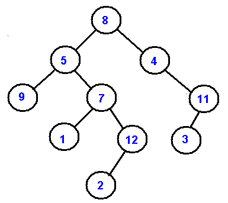

# Exercises and Notes on Binary Tree

# What is a Binary Tree?
Top most node is called the root. At most, each node can have 2 children, left or right. Every node is connected by a **directed edge** from parent to child. 

# Basic terminologies
- leaves: nodes without any children
- internal nodes: nodes in between root and leaves

## Height
**Definition** Height *of a node*: number of edges from the node to the deepest leaf

**Definition** Height *of a tree*: height of the root

## Depth
**Definition** Number of edges from the root to the node

## Complete vs Full Tree
- Complete tree: Every level is completely filled except possibly at the last, 
- Full tree: Every node other than leaves has two children and *all nodes are as far left as possible*

# Traversals
a process to visit all nodes in the tree.  Tree = nonlinear data structure, nonlinearity sometimes -> no unique solution unless there are specific conditions like initial conditions or boundaries. Therefore, no unique traversals.  Two kinds:
1. depth-first traversal
 - pre-order: parent, left, right
 - in-order: left, parent, right
 - post-order: left, right, parent
2. bredth-first traversal = level order traversal, dequeue nodes at a level and enqueue all children.

## Example
- pre-order: 
- in-order: 
- post-order: 
- bredth-first/level-order: 8, 5, 4, 9, 7, 11, 1, 12, 3, 2

# Binary Search Trees
coming soon.

# References
- https://www.cs.cmu.edu/~adamchik/15-121/lectures/Trees/trees.html
- https://www.cs.cmu.edu/~tcortina/15-121sp10/Unit06A.pdf
- https://ocw.mit.edu/courses/electrical-engineering-and-computer-science/6-006-introduction-to-algorithms-spring-2008/lecture-notes/
- https://ocw.mit.edu/courses/electrical-engineering-and-computer-science/6-006-introduction-to-algorithms-spring-2008/lecture-notes/lec4.pdf
- difference between full and complete trees: https://web.cecs.pdx.edu/~sheard/course/Cs163/Doc/FullvsComplete.html#:~:text=Full%20v.s.%20Complete%20Binary%20Trees&text=A%20full%20binary%20tree%20(sometimes,as%20far%20left%20as%20possible.